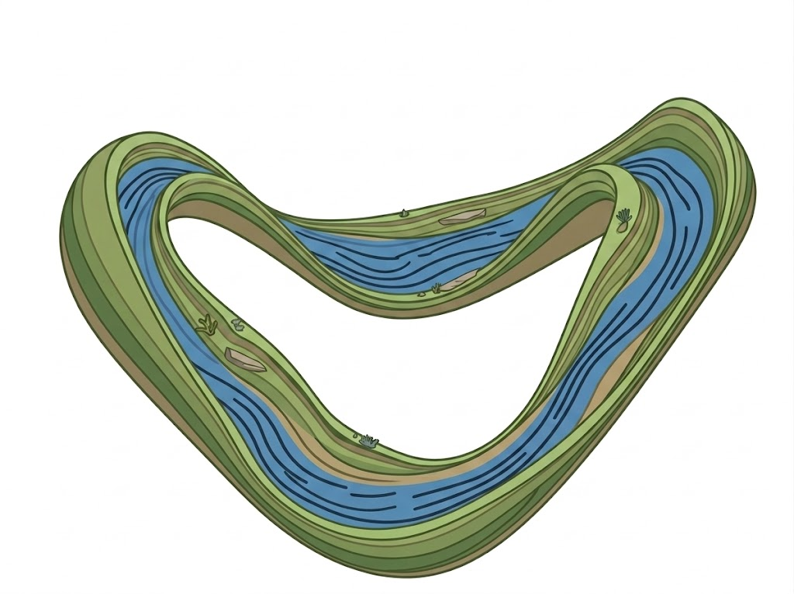
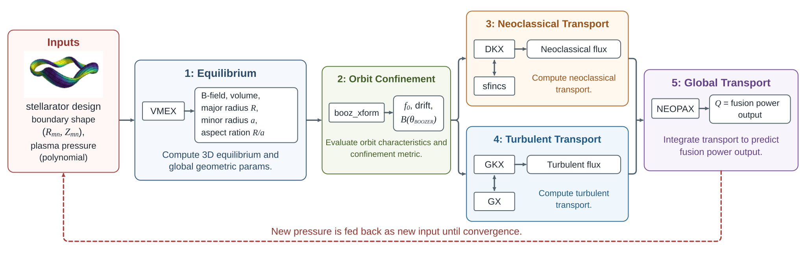
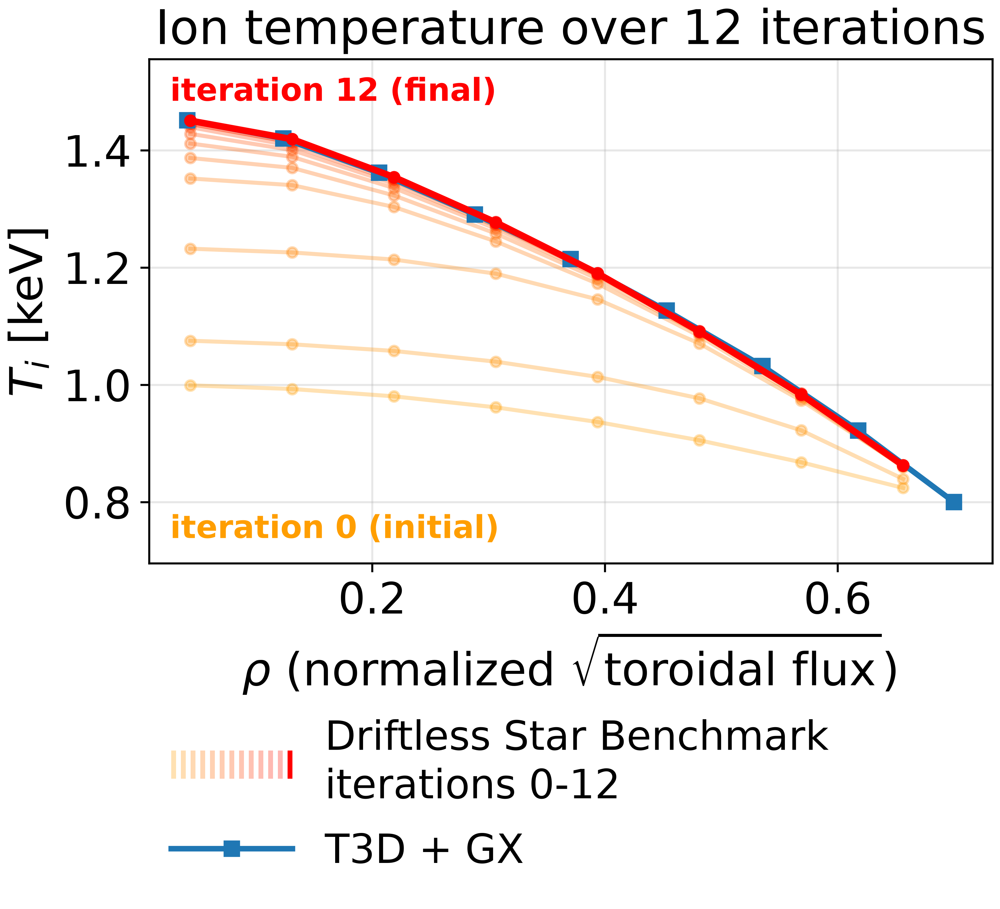
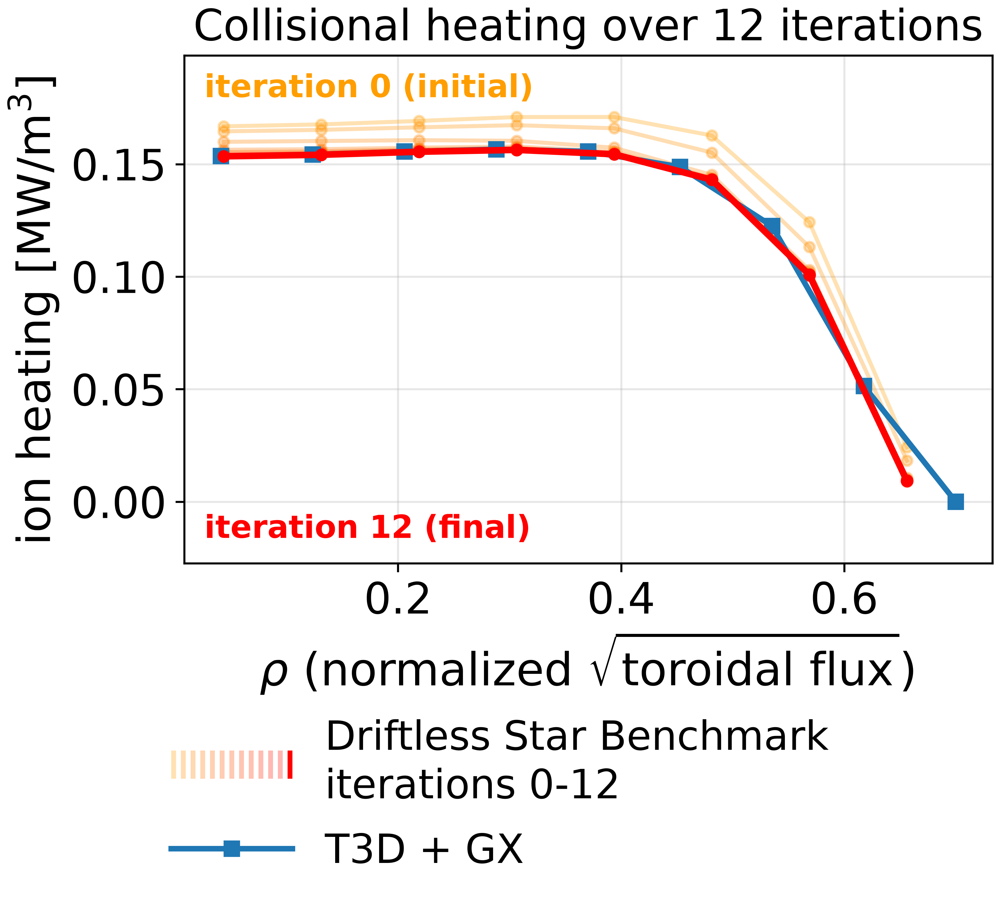
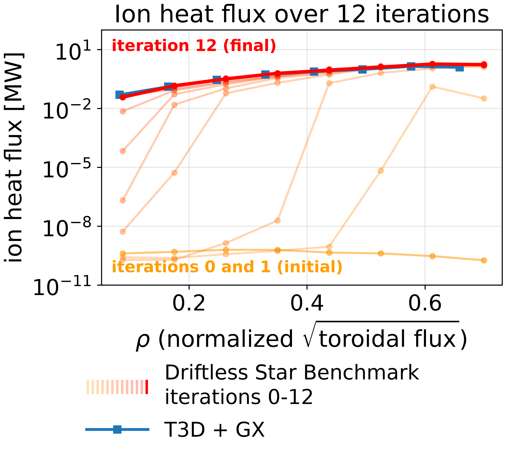
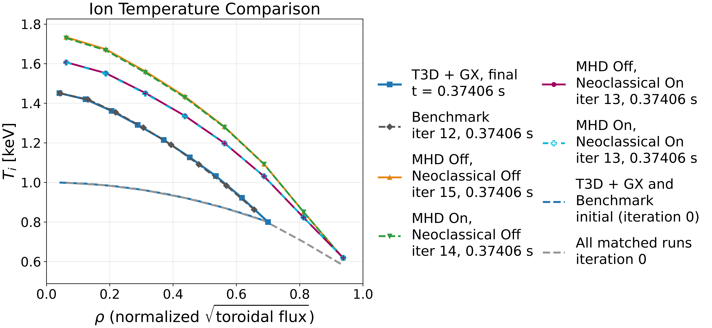

<p align="center">
  
</p>

# Driftless Star

Driftless Star is an open-source workflow that computes transport-consistent plasma profiles for a given stellarator boundary and plasma conditions in a unified, reproducible pipeline. It takes in a plasma pressure profile and boundary shape for the magnetic confinement and returns the generated power output. Along the way, it determines the nested flux surfaces needed to achieve magnetic equilibrium, calculates the heat and particle fluxes between the nested surfaces, and uses the fluxes to evolve the pressure profiles which can be used to repeat the loop until the pressure and equilibrium is consistent with each other.

The pipeline also enables AI-accelerated fusion device design by allowing neural surrogates to replace costly physics stages and large language model agents to orchestrate the chain, make judgment calls between stages, and autonomously search for improved geometries.

## How it works

We use [Snakemake](https://snakemake.github.io/) to turn a suite of complicated, individual software into an easily runnable set of software connected by a directed acyclic graph. 
[](docs/_static/workflow.svg)

[Pixi](https://pixi.prefix.dev/) prepares the workflow environment, [Docker](https://www.docker.com/) downloads the [physics containers](https://github.com/driftless-star/driftless-star/pkgs/container/driftless-star) as needed, and each software runs inside it's own docker container. Driftless Star also supports [Apptainer](https://apptainer.org/) as an alternative to Docker.

## Quick start

1. Install [Pixi](https://pixi.prefix.dev/latest/installation/).
2. Install [Docker Engine for Linux](https://docs.docker.com/engine/install/) or [Docker Desktop for Mac](https://docs.docker.com/desktop/setup/install/mac-install/) (or alternatively, [Apptainer](https://apptainer.org/docs/user/main/quick_start.html)).
3. With Docker running:

```bash
git clone https://github.com/driftless-star/driftless-star.git
cd driftless-star
```

For a single forward run:

```bash
pixi run driftless-star-fwd --configfile inputs/quick_run/config.yaml --cores 4
```

It computes geometry and fluxes, evolves the profiles once, and stops after Stage 5, giving you the power output.

To loop until convergence (or the max number of iterations):

```bash
pixi run driftless-star --config inputs/quick_run/config.yaml --max-iters 3 --cores 4
```

The updated pressure profiles is fed back into Stage 1 to restart the loop for another iteration until a stop is triggered. Each iteration writes to `outputs/quick_run/loop/iter_N/`.

Results are saved under `outputs/quick_run/`. The main transport result is `outputs/quick_run/stage5_transport/transport_solution.h5`, containing the evolved density, temperature, radial electric-field profiles, and computed net heating power. The quick_run case uses reduced resolution to introduce the workflow.
### Run with Apptainer

Install [Apptainer](https://apptainer.org/docs/user/main/quick_start.html) and make sure the `apptainer` command is available on your `PATH`.

Add this top-level setting to `inputs/quick_run/config.yaml`, then you can use either of the commands above:

```yaml
container_runtime: apptainer
```

You can also select Apptainer as a command line argument without editing the config:

```bash
pixi run driftless-star-fwd --configfile inputs/quick_run/config.yaml --config container_runtime=apptainer --cores 4
```

```bash
pixi run driftless-star --config inputs/quick_run/config.yaml --container-runtime apptainer --max-iters 3 --cores 4
```

### Run the W7-X benchmark

To replicate the plasma profile evolution from the [T3D+GX example](https://t3d.readthedocs.io/en/latest/QuickGX.html), we have an input file that uses identical initial profiles.

The W7-X cases use GPUs by default. Set `gpu_ids` and `jobs_per_gpu` in the selected `config.yaml` to match your host. See [GPU setup and scheduling](docs/mvp-pipeline.md#multi-gpu-scheduling) for details.

The benchmark keeps the supplied equilibrium fixed and disables neoclassical transport. From the repository root, copy the supplied equilibrium into the first iteration's output directory to skip Stage 1.

```bash
mkdir -p outputs/w7-x/t3d_benchmark/loop/iter_1/output/stage1_equilibrium
cp inputs/w7-x/t3d_benchmark/wout_w7x_t3d_reconstruction.nc \
  outputs/w7-x/t3d_benchmark/loop/iter_1/output/stage1_equilibrium/wout_w7x_t3d_reconstruction.nc
```

Then run the loop.

```bash
pixi run driftless-star --config inputs/w7-x/t3d_benchmark/config.yaml --max-iters 400 --cores 8
```

The loop runs for at most 400 iterations and can stop earlier when it converges, reaches the configured transport time, or reports a halt. Each iteration writes to `outputs/w7-x/t3d_benchmark/loop/iter_N/`, with the transport result in `output/stage5_transport/transport_solution.h5`.

### Run the W7-X comparison cases

The four other W7-X cases vary equilibrium feedback and neoclassical transport. Each case calculates its initial equilibrium automatically. With equilibrium feedback off, it reuses that equilibrium in later iterations.

| Case | Equilibrium feedback | Neoclassical transport |
| --- | --- | --- |
| [`mhd_off_neoclassical_off`](inputs/w7-x/mhd_off_neoclassical_off/config.yaml) | Off | Off |
| [`mhd_off_neoclassical_on`](inputs/w7-x/mhd_off_neoclassical_on/config.yaml) | Off | On |
| [`mhd_on_neoclassical_off`](inputs/w7-x/mhd_on_neoclassical_off/config.yaml) | On | Off |
| [`mhd_on_neoclassical_on`](inputs/w7-x/mhd_on_neoclassical_on/config.yaml) | On | On |

For example, to run with both equilibrium feedback and neoclassical transport enabled, use

```bash
pixi run driftless-star --config inputs/w7-x/mhd_on_neoclassical_on/config.yaml --max-iters 400 --cores 8
```

Replace `mhd_on_neoclassical_on` with another case from the table to run that configuration. Each iteration writes to `outputs/w7-x/<case>/loop/iter_N/`, with the transport result in `output/stage5_transport/transport_solution.h5`.

### W7-X results

Example results from the benchmark and the four comparison cases, with the T3D+GX reference.

<p align="center">
  <a href="docs/_static/w7-x/iteration_ion_temperature.png"></a>
  <a href="docs/_static/w7-x/iteration_collisional_exchange.png"></a>
  <a href="docs/_static/w7-x/ion_heat_flux_power_log.png"></a>
</p>
<p align="center">
  <a href="docs/_static/w7-x/ion_temperature_comparison.png"></a>
</p>


## Currently Supported Software

Driftless Star supports modularity, allowing different software to be containerized and used as replacements for individual stages. We currently support these software but are expanding rapidly. If you would like a specific software to be supported and integrated, please contact us or create a feature request issue.

| Stage | What it does           | Software                                                     |
| ----- | ---------------------- | ------------------------------------------------------------ |
| 1     | Magnetic Equilibrium   | [VMEX](https://github.com/uwplasma/vmex)                     |
| 2     | Boozer Transform       | [booz_xform_jax](https://github.com/uwplasma/booz_xform_jax) |
| 3     | Neoclassical Transport | [DKX](https://github.com/uwplasma/DKX)                       |
| 4     | Turbulent Transport    | [GKX](https://github.com/uwplasma/GKX)                       |
| 5     | Global Transport       | [NEOPAX](https://github.com/uwplasma/NEOPAX)                 |


## Learn more

The project is under active development. For help, bug reports, or feature requests, open an issue in the [public repository](https://github.com/driftless-star/driftless-star/issues). Please include your command, configuration, and relevant logs when reporting a failed run.

## Authors

<p align="left">
  R. K. Hashmani<sup>1</sup>, E. Neto<sup>1</sup>, Y. Zhang<sup>2</sup>, M. Feickert<sup>3</sup>, A. Wright<sup>4</sup>, S. Wright<sup>2</sup>, Q. Li<sup>5</sup>, M. Khodak<sup>2</sup>, K. Cranmer<sup>1</sup>, R. Jorge<sup>1</sup>
</p>
<p align="left">
  <sup>1</sup> Department of Physics, University of Wisconsin-Madison, WI, USA<br>
  <sup>2</sup> Department of Computer Sciences, University of Wisconsin-Madison, WI, USA<br>
  <sup>3</sup> Data Science Institute, University of Wisconsin-Madison, WI, USA<br>
  <sup>4</sup> Department of Nuclear Engineering &amp; Engineering Physics, University of Wisconsin-Madison, WI, USA<br>
  <sup>5</sup> Department of Mathematics, University of Wisconsin-Madison, WI, USA
</p>

## License

Driftless Star is available under the [MIT license](LICENSE).
