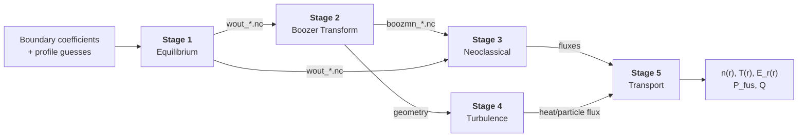

# driftless-star

driftless-star is an open-source pipeline for stellarator design. It connects five physics stages (equilibrium, Boozer transform, neoclassical transport, turbulence, and profile evolution) and their relevant software into a single reproducible workflow. Given a stellarator boundary shape and initial plasma profiles, the pipeline produces transport-consistent density and temperature profiles along with fusion-power metrics.

Each stage is modular so that implementations can be swapped independently. The pipeline is designed to be closed-loop, so output profiles can be fed back as input for iterative optimization.

See [Progress](#progress) below.



Stages 3 and 4 run in parallel. Each stage should eventually be independently swappable (see [guide](docs/guide.md#swappability-patterns)).

## Quick Reference

| Resource                                | Location                                                       |
| --------------------------------------- | -------------------------------------------------------------- |
| Pipeline design & contributor workflow  | [`docs/guide.md`](docs/guide.md)                               |
| Stage I/O specs                         | [`docs/stage{N}-{name}/spec.md`](docs/)                        |
| MVP I/O reference & Pixi commands       | [`docs/mvp-pipeline.md`](docs/mvp-pipeline.md)                 |
| Physics equations & I/O contracts (TeX) | [`stellarator_workflow/`](stellarator_workflow/)               |
| I/O validation methodology              | [`docs/guide.md#io-validation`](docs/guide.md#io-validation)          |
| Coding standards                        | [`docs/guide.md#coding-conventions`](docs/guide.md#coding-conventions) |

## Pipeline Stages

| Stage | Physics | JAX Primary | Alternatives |
|-------|---------|-------------|--------------|
| 1. Equilibrium | Ideal-MHD force balance | [vmex](https://github.com/uwplasma/vmex), [DESC](https://github.com/PlasmaControl/DESC) | [VMEC++](https://github.com/proximafusion/vmecpp) |
| 2. Boozer Transform | Coordinate transform | [booz_xform_jax](https://github.com/uwplasma/booz_xform_jax) | [BOOZ_XFORM](https://github.com/hiddenSymmetries/booz_xform) |
| 3. Neoclassical | Effective ripple, drift-kinetic | [NEO_JAX](https://github.com/uwplasma/NEO_JAX), [DKX](https://github.com/uwplasma/DKX) | [NEO](https://github.com/PrincetonUniversity/STELLOPT), [SFINCS](https://github.com/landreman/sfincs) |
| 4. Turbulence | Gyrokinetic equation | [GKX](https://github.com/uwplasma/GKX) | [GX](https://bitbucket.org/gyrokinetics/gx), [GENE](https://genecode.org) |
| 5. Transport | Profile evolution, power balance | [NEOPAX](https://github.com/uwplasma/NEOPAX) | [Trinity3D](https://bitbucket.org/gyrokinetics/t3d) |

## Where to Put Code

**Phase 1** work goes into the stage spec docs (`docs/stage{N}-{name}/spec.md`) -- the "TO BE COMPLETED" sections.

**Phase 2** adds containers and tests. Stage dependencies are managed through a Pixi workspace under `stages/` (`stages/pixi.toml` + `stages/pixi.lock`), and a single templated `stages/Dockerfile` builds all stages via build arguments. The Snakemake orchestration environment lives in a separate root-level Pixi workspace (`pixi.toml`) so it can be installed on execution nodes without nesting containers. See [guide](docs/guide.md#container-architecture) for details.

## Workflow

1. [Fork](https://github.com/driftless-star/driftless-star/fork) the repository and branch from `main` (e.g., `feat/stage1-newsoftware`)
2. Work through the relevant phase in the [Guide](docs/guide.md#getting-started)
3. Open a PR from the fork when deliverables are ready and request a review
4. After review and merge, the corresponding item below gets checked off

## Progress

### Phase 1: Document & Run

Install the primary code, document the API and convergence behavior, write example scripts, set up W&B tracking. Full checklist in the [Guide](docs/guide.md#phase-1-document--run).

- [ ] Stage 1 -- Equilibrium
  - [ ] `vmex`
  - [ ] `DESC`
  - [ ] `VMEC++`
- [ ] Stage 2 -- Boozer Transform
  - [ ] `booz_xform_jax`
  - [ ] `BOOZ_XFORM`
- [ ] Stage 3 -- Neoclassical
  - [ ] `DKX`
  - [ ] `NEO_JAX`
  - [ ] `NEO`
  - [ ] `SFINCS`
- [ ] Stage 4 -- Turbulence
  - [ ] `GKX`
  - [ ] `GX`
  - [ ] `GENE`
- [ ] Stage 5 -- Transport
  - [ ] `NEOPAX`
  - [ ] `Trinity3D`

### Phase 2: Containerize & Test

Containerize stages and write tests. Full checklist in the [Guide](docs/guide.md#phase-2-containerize--test).

- [ ] Stage 1 -- Equilibrium
  - [x] `vmex`
  - [x] `DESC`
  - [ ] `VMEC++`
- [x] Stage 2 -- Boozer Transform
  - [x] `booz_xform_jax`
  - [x] `BOOZ_XFORM`
- [ ] Stage 3 -- Neoclassical
  - [x] `NEO_JAX`
  - [x] `DKX`
  - [ ] `NEO`
  - [x] `SFINCS`
- [ ] Stage 4 -- Turbulence
  - [x] `GKX`
  - [ ] `GX`
  - [ ] `GENE`
- [x] Stage 5 -- Transport
  - [x] `NEOPAX`
  - [x] `Trinity3D`

### Phase 3: Integrate

Snakemake DAG, end-to-end tests, and publishing. Details in the [Guide](docs/guide.md#phase-3-integrate).

- [ ] `config.yaml` + Snakemake DAG
- [ ] Swappability patterns (single-stage, multi-stage, end-to-end)
- [ ] End-to-end integration tests
- [ ] Pipeline-level W&B aggregation
- [ ] GHCR image publishing

## Usage

A *run* is a folder under `inputs/` that holds its run config (`config.yaml`) and the inputs required by enabled stages. `inputs/quick_run/` is the reduced-accuracy example. The five [W7-X comparison cases](inputs/w7-x/) live under `inputs/w7-x/` and include every required stage input. Their `t3d_benchmark` case also includes a supplied equilibrium that must be [copied into the output tree](inputs/w7-x/t3d_benchmark/README.md) before launch. `common_input.toml` in each run folder is the shared transport config read by Stages 3, 4, and 5. Stage 3 and Stage 4 can be [skipped automatically through their shared flux selectors](docs/mvp-pipeline.md#automatic-producer-skipping).

`driftless-star` iterates toward transport-consistent profiles by chaining forward passes. Each pass's Stage 5 transport solution feeds the next one three ways: as a boundary refit from the evolved pressure, as kinetic profiles prescribed to Stages 3, 4, and 5, and as the advanced transport clock.

```
pixi run driftless-star --config inputs/quick_run/config.yaml --max-iters 3 --cores 4
```

Each iteration is a full pipeline run under its own `outputs/<run>/loop/iter_N/` tree (`outputs/` is gitignored). Stage 5 writes `output/stage5_post_processing/converge_status.json`, and the driver stops early once the pressure profile settles under the config's `convergence.method` (`rms` or `pointwise`) and `convergence.pressure_rel_tol`. It starts another iteration only for `continue`, stops for `converged`, `horizon`, or `halted`, and also stops at `--max-iters`. Stages listed under `loop.rerun` as `false` are frozen, so iterations after the first reuse their iteration 1 artifacts. See [docs/mvp-pipeline.md](docs/mvp-pipeline.md#closing-the-loop).

### Run a single forward pass

One traversal from Stage 1 to Stage 5, without the transport feedback the loop adds:

```
pixi run driftless-star-fwd --configfile inputs/quick_run/config.yaml --cores 4
```

Its artifacts land under `outputs/<run>/stageN_<name>/`, one directory per stage, which is the flat layout the stage specs reference. A loop iteration writes that same tree one level down, under `outputs/<run>/loop/iter_N/output/`.

### Define your own run

Copy the example, repoint `input_dir`/`output_dir`, and edit the inputs. Either entry point takes the new config the same way:

```
cp -r inputs/quick_run inputs/my_run
# in inputs/my_run/config.yaml, set input_dir: inputs/my_run and output_dir: outputs/my_run,
# then edit the boundary, profiles, and resolution as needed
pixi run driftless-star-fwd --configfile inputs/my_run/config.yaml --cores 4
```

### Run on GPUs

Two top-level run-config keys pick the `-gpu` image variant for every stage and the device pool its containers may use:

```yaml
gpu_ids: "4,5,6,7"   # null runs CPU images; "all" uses every GPU the execution host reports
jobs_per_gpu: 2      # concurrent jobs allowed per GPU
```

Every concurrent job is pinned to one free slot of that pool, so the pool offers pool size times `jobs_per_gpu` slots and saturating it takes at least that many cores. Either key can be overridden per invocation, on a forward pass or on the loop:

```
pixi run driftless-star-fwd --configfile inputs/quick_run/config.yaml --cores 8 --config gpu_ids=4,5,6,7 jobs_per_gpu=2
pixi run driftless-star --config inputs/quick_run/config.yaml --cores 8 --gpu-ids 4,5,6,7 --jobs-per-gpu 2
```

GPU mode needs an NVIDIA host with `nvidia-container-toolkit` configured on the docker daemon. See [docs/mvp-pipeline.md](docs/mvp-pipeline.md#multi-gpu-scheduling) for how the pinning works, how to share a host with other users, and the current limitations.

### Recreate the Trinity3D + GX validation

The W7-X comparison configurations use `stage3.dkx` and write `dkx_flux_profiles.h5` when neoclassical transport is enabled. Cases with neoclassical transport off, including the benchmark, skip Stage 3 entirely. To resume an older run whose enabled Stage 3 artifact is named `sfincs_jax_flux_profiles.h5`, set `filenames.s3_output` to that existing filename in the run config.

`inputs/w7-x/t3d_benchmark/` provides the Driftless Star benchmark compared with the separate Trinity3D + GX reference. Frozen 6.7 keV electrons heat the evolving 1 keV ions through collisional exchange while ITG turbulence limits the resulting gradient. The transport grid has eight cells bounded by nine faces out to rho = 0.7. Stage 3 is skipped. Stage 4 omits the magnetic axis and scans the eight non-axis faces. Iteration 1 uses the analytical `[profiles]` parameters. Later iterations prescribe profiles from the previous transport solution while keeping the supplied equilibrium fixed.

Before launching, follow the [supplied-equilibrium setup](inputs/w7-x/t3d_benchmark/README.md) so Stage 1 uses the included NetCDF file. Make the workflow's GPU images available and adjust `gpu_ids` and `jobs_per_gpu` for your host. Then run the loop.

```
pixi run driftless-star --config inputs/w7-x/t3d_benchmark/config.yaml --max-iters 400 --cores 8
```

Each iteration lands under `outputs/w7-x/t3d_benchmark/loop/iter_N/`. Its status signal is `output/stage5_post_processing/converge_status.json`. The last completed iteration's `output/stage5_transport/transport_solution.h5` contains the ion temperature profile for comparison with Trinity3D's `test-w7x-gx` case at the same transport time.

The four other [W7-X comparison cases](inputs/w7-x/) use matched initial pressure on the full radial domain and vary equilibrium feedback and neoclassical transport.

Once all five cases have run, `stages/stage5-post-processing/plot_w7x_figures.py` draws the five comparison figures into `outputs/w7-x/plots/`. It needs the stage-5 environment, because the collisional-heating figure evaluates the saved source models through NEOPAX. Run it from the repository root inside the stage-5 image. Add `--t3d-nc <path>` to overlay the Trinity3D + GX reference when you have that NetCDF file; without it the figures show the Driftless Star runs alone.

```
docker run --rm -e HOME=/tmp -v "$PWD:/work" -w /work ghcr.io/driftless-star/driftless-star:stage-5-neopax-cpu \
    python stages/stage5-post-processing/plot_w7x_figures.py
```

### Visualize the pipeline graph

Render the file-flow graph (files as nodes, rules as edges) **including the closed-loop post-processing step** by targeting the convergence signal file:

```
pixi run -e pipeline bash -c 'snakemake --filegraph outputs/quick_run/stage5_post_processing/converge_status.json --configfile inputs/quick_run/config.yaml | dot -Tpdf > docs/figs/stellaforge_filegraph.pdf'
```

Omit the target to graph the plain forward pass (stops at Stage 5). Needs a one-time `pixi run -e pipeline dot -c`; see [docs/mvp-pipeline.md](docs/mvp-pipeline.md#visualizing-the-file-flow-graph) for PNG/SVG and `--rulegraph`/`--dag` variants, including [drawing the complete per-surface job DAG](docs/mvp-pipeline.md#drawing-the-complete-per-surface-job-dag) (the Stage 3/4 fan-out appears in `--dag` output only after the `prepare` manifests exist).

<!--
git clone https://github.com/driftless-star/driftless-star.git
cd driftless-star
git submodule update --init --recursive
snakemake --sdm docker --configfile inputs/quick_run/config.yaml
docker pull ghcr.io/driftless-star/driftless-star:stage-1-vmex-cpu
-->

## License

[MIT](LICENSE)
